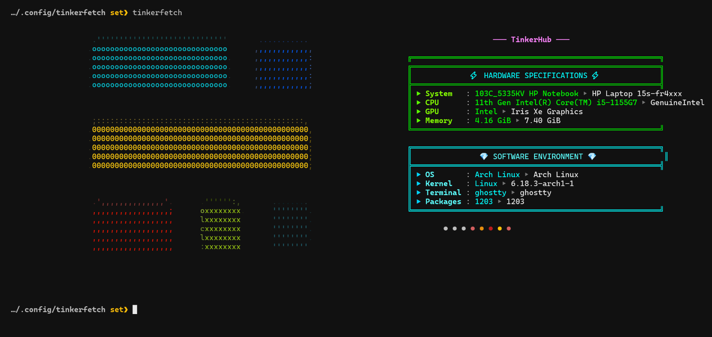

# ⚡ Tinkerfetch

**Tinkerfetch** is a terminal-based "TinkerHub" themed system information tool. It's a custom-designed "skin" for the [Fastfetch](https://github.com/fastfetch-cli/fastfetch) engine, featuring a dedicated mode to track upcoming community events.



---

## ✨ Features

* **Aesthetic:** Custom-colored boxes using 8-bit ANSI escape sequences.
* **Event Tracking:** Real-time fetching of upcoming TinkerHub events via `tinkerfetch --events`.
* **Compatibility:** Works on Linux and macOS (Bash & Zsh).
* **Smart Installer:** Automates dependency checks, path configuration, and updates.

---

## 🚀 Installation

### 1. Prerequisites

Tinkerfetch is built on top of **Fastfetch**. You will also need standard utilities for the events feature.

*   **Core:** `fastfetch`
*   **Utilities:** `curl`, `jq`, `perl`

**Install Fastfetch:**
*   **Arch Linux:** `sudo pacman -S fastfetch`
*   **Ubuntu/Debian:** `sudo apt install fastfetch`
*   **Fedora:** `sudo dnf install fastfetch`
*   **macOS:** `brew install fastfetch`

*(The installer will automatically check for the utility dependencies and notify you if any are missing.)*

### 2. Install

**Option A: Quick Install (User)**
Run this one-liner to download and install the latest version from GitHub:
```bash
curl -sL https://raw.githubusercontent.com/Sabari-Vijayan/tinkerfetch/main/install.sh | bash
```

**Option B: Manual Install (Developer)**
If you have cloned the repository, you can install directly from the source:
```bash
# Inside the tinkerfetch directory
./install.sh
```

### 3. Usage

After installation, restart your terminal or run `source ~/.bashrc` (or `source ~/.zshrc`).

**Default View (System Info):**
```bash
tinkerfetch
```

**Events View (Upcoming Tech Events):**
```bash
tinkerfetch --events
```

---

## 📂 Project Structure

*   **tinkerfetch:** The executable wrapper script.
*   **config.jsonc:** Layout configuration for system stats.
*   **events.jsonc:** Layout configuration for the events display.
*   **install.sh:** Universal installer (handles both remote and local installs).
*   **logo.txt:** Custom ASCII art used in the sidebar.

---

**Created by [Sabari-Vijayan](https://github.com/Sabari-Vijayan)**